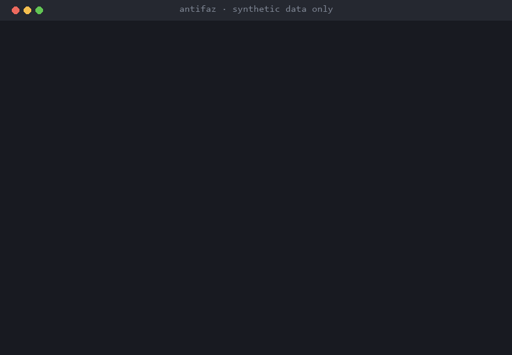

<p align="center"></p>

<h1 align="center">Antifaz</h1>

<p align="center"><b>Use any LLM with your customers' data, without sending it.</b><br><a href="README.es.md">Leer en español</a></p>

<p align="center">
  <a href="https://github.com/miquel-moreno/antifaz/releases"></a>
  <a href="https://github.com/miquel-moreno/antifaz/actions/workflows/ci.yml?query=branch%3Amain"></a>
  <a href="LICENSE"></a>
  <a href="https://www.python.org/"></a>
  <a href="https://fastapi.tiangolo.com/"></a>
  <a href="https://github.com/miquel-moreno/antifaz/pkgs/container/antifaz"></a>
  <a href="#quick-start"></a>
  <a href="https://github.com/miquel-moreno/antifaz/releases/tag/v0.1.0"></a>
  <a href="https://github.com/miquel-moreno/antifaz/stargazers"></a>
</p>

Companies want to use ChatGPT or Claude with customer emails and documents, but sending personal data to them is a privacy risk. Antifaz sits in between and swaps that data for placeholders before the text leaves.



## What it does
- Finds personal data in the text, with a focus on Spanish and EU IDs (DNI, NIE, social security number, IBAN…), and replaces it with placeholders like `[[ES_DNI_1]]`.
- Sends only the placeholders to OpenAI or Anthropic and puts the real values back in the answer.
- If anything goes wrong while checking a request, it blocks it instead of letting it through.

## Result
- On a public Spanish benchmark, names left exposed drop from 100 to 2.5 out of 100 with the optional name detector (it also hides some text that is not personal: details below).
- Checks a document in about 3 milliseconds without the name detector, and 960 attack tests pass.

## Technologies
Python · FastAPI · LLM APIs (OpenAI, Anthropic) · NLP (GLiNER) · Privacy (GDPR) · Docker · GitHub Actions · pytest

## My role
Designed and built end to end. AI-assisted development under my specification and review.

[Technical details (in Spanish) →](docs/TECNICO.md) · [LinkedIn](https://www.linkedin.com/in/miquel-moreno-martinez)

---

> [!WARNING]
> **Beta: [v0.1.0 is released](https://github.com/miquel-moreno/antifaz/releases/tag/v0.1.0).** Antifaz **does not guarantee finding all personal data**: it only protects what it detects, and the [benchmark](docs/benchmark.md) shows how much slips through. Test it with your own kind of texts before using it with real data.

## Quick start

You need Docker with Compose. The published image is `ghcr.io/miquel-moreno/antifaz:0.1.0` (`docker pull ghcr.io/miquel-moreno/antifaz:0.1.0`).

```bash
git clone https://github.com/miquel-moreno/antifaz && cd antifaz
cp .env.example .env
# Edit .env:
#   ANTIFAZ_API_KEY: a random value, for example the output of `openssl rand -hex 32`
#   ANTIFAZ_OPENAI_API_KEY and/or ANTIFAZ_ANTHROPIC_API_KEY: your provider keys
#   (delete the line of a provider you do not use: its route answers 503)
docker compose up -d --build
curl http://127.0.0.1:8000/healthz   # {"status":"ok","version":"0.1.0"}
```

Antifaz refuses to start while a key still has its example value (`change-me...`); `docker compose logs antifaz` says which variable to fix, never its value. It listens on `127.0.0.1` only: to reach it from other machines, put a reverse proxy with HTTPS in front ([details](docs/TECNICO.md)).

Then point your client at Antifaz instead of the provider, with your `ANTIFAZ_API_KEY` as the key (the provider keys stay in `.env`):

```python
from openai import OpenAI

client = OpenAI(base_url="http://localhost:8000/v1", api_key="<your ANTIFAZ_API_KEY>")
```

```python
from anthropic import Anthropic

client = Anthropic(base_url="http://localhost:8000", api_key="<your ANTIFAZ_API_KEY>")
```

```bash
curl http://localhost:8000/v1/chat/completions \
  -H "Authorization: Bearer $ANTIFAZ_API_KEY" -H "Content-Type: application/json" \
  -d '{"model": "gpt-4.1-nano", "messages": [{"role": "user", "content": "My DNI is 12345678Z"}]}'
```

**Claude Code**: set `ANTHROPIC_BASE_URL=http://localhost:8000` and `ANTHROPIC_API_KEY` to your `ANTIFAZ_API_KEY`. Not tested against the real Anthropic API yet (only with the official SDK and recorded answers).

What works in v0.1: OpenAI Chat Completions and Anthropic Messages (with `count_tokens`), with and without streaming, tool calls and reasoning blocks; `GET /v1/models`; and `POST /antifaz/scan`, which says where the personal data is (types and positions, never the values). Tested with the official OpenAI and Anthropic Python SDKs, and once against the real OpenAI API.

To check your own configuration without calling any provider: `uv run antifaz verify` (from a clone, with [uv](https://docs.astral.sh/uv/)). It plants fake values in every part of a request and fails if one reaches a fake provider.

## What it detects

Only types with tests. The default policy masks all of them except company tax IDs (CIF).

| Data | Placeholder | How it is found |
|---|---|---|
| DNI, NIE, NIF K/L/M | `ES_DNI`, `ES_NIE`, `ES_NIF` | Check digit |
| Company tax ID (CIF) | `ES_CIF` | Check digit (not masked by default) |
| Social security number (NSS) | `ES_NSS` | Check digit |
| Bank account (CCC) and IBAN | `ES_CCC`, `IBAN` | Check digit |
| Payment card | `CREDIT_CARD` | Luhn check and known prefix |
| Italian codice fiscale, EU VAT number | `IT_CODICE_FISCALE`, `EU_VAT` | Check digit (python-stdnum) |
| Email | `EMAIL` | Pattern |
| Spanish phone number | `PHONE` | Pattern |
| IPv4 address | `IP` | Pattern |
| Spanish, Catalan and Galician style address | `ADDRESS` | Pattern |
| Passport, licence plate, date of birth | `ES_PASSPORT`, `ES_PLATE`, `DATE_OF_BIRTH` | Pattern with a keyword before it |
| Portuguese, French and German IDs | `PT_NIF`, `FR_NIR`, `DE_IDNR` | Check digit with a keyword before it |
| Person names | `PERSON` | Optional NER model, **off by default** |

Detection uses no generative AI and runs locally. Without the optional NER, **person names are not detected**.

## Benchmark

Measured on the test set of [MEDDOCAN](docs/benchmark.md) (250 synthetic Spanish clinical cases written by third parties) with the same script and metrics for every tool. Lower is better: personal values left exposed out of every 100.

| Values left exposed (per 100) | Antifaz | Antifaz + NER | Presidio |
|---|---|---|---|
| All annotated personal data | 86.9 | 61.6 | 47.5 |
| Person names | 100 | 2.5 | 7.8 |
| Street addresses | 60.3 | 12.3 | 97.6 |
| Emails | 0.8 | 0.4 | 0.8 |
| Time per document (median) | 2.87 ms | 1947 ms (cold cache) | 27.53 ms |

- **Presidio leaves less exposed overall** than Antifaz, with or without NER: it also hides places, organisations and dates, which Antifaz does not look for yet. MEDDOCAN is clinical text (ages, hospitals, dates…) and has no DNI, IBAN or card numbers.
- **The NER does not meet the precision floor set in advance (85 %)**: about 25 % of its name detections hide text that is not personal data (precision 75.2 %). That is why it ships optional and off.
- On a synthetic set of 600 texts with Spanish IDs, Antifaz leaves 0 values exposed per 100 and Presidio 29.5. That set was written by the same team as the detector, so it favours Antifaz.

Full tables, configuration and limits: [docs/benchmark.md](docs/benchmark.md) (in Spanish). Run it yourself with `make bench`.

## Security

- **Fail-closed**: a request is blocked if the detector fails or if it carries an image, a PDF, a file or another field that cannot be masked. Text in an unknown field is masked too, not sent as it is.
- **Egress guard**: a second check on the exact bytes about to leave; if a hidden value is still there, the request is blocked.
- **Closed by default**: every route needs the Antifaz key, browsers are refused, provider URLs and keys are only read from `.env`, and Antifaz will not start with a weak or example key.
- **Tested by attacking it**: 960 red-team tests pass; 13 more are documented known gaps, written down as expected failures. An end-to-end test runs the real Docker image against a fake provider and checks it only ever receives placeholders.

Found a problem? Read [SECURITY.md](SECURITY.md): vulnerabilities are reported privately. A value that Antifaz does not detect is a public issue with **synthetic data only** ([I found a leak](https://github.com/miquel-moreno/antifaz/issues/new?template=leak.yml)).

## What Antifaz is not

- It does not anonymise: it **pseudonymises**. It only protects what it detects, and no detector is perfect.
- It does not stop a model from inferring things from context (writing style, details left in the text).
- It does not process images or files: it blocks them.
- It is not a browser DLP, and installing it does not make anyone GDPR compliant. It helps minimise the personal data sent to LLM providers; it is not legal advice.

## Known limitations

- Person names are only detected with the optional NER, which is off by default.
- Many clinical data types (ages, dates, hospitals, record numbers) are not detected yet.
- Encoded text (base64, hexadecimal) is not decoded.
- No rate limits and no evidence log yet (planned for v0.2).
- The Docker image is only tested on `linux/amd64`.

The full list is in [docs/TECNICO.md](docs/TECNICO.md#limitaciones) (in Spanish).

## Telemetry

Antifaz sends nothing anywhere except to the provider you configure. It makes no other outbound connections, has no analytics and does not phone home. The optional NER runs offline, from a model you download once with `make ner-model`.

## License

The code is under the [Apache-2.0](LICENSE) license. The name "Antifaz" and the logo are not covered by it: see [LICENSE-ASSETS.md](LICENSE-ASSETS.md).
